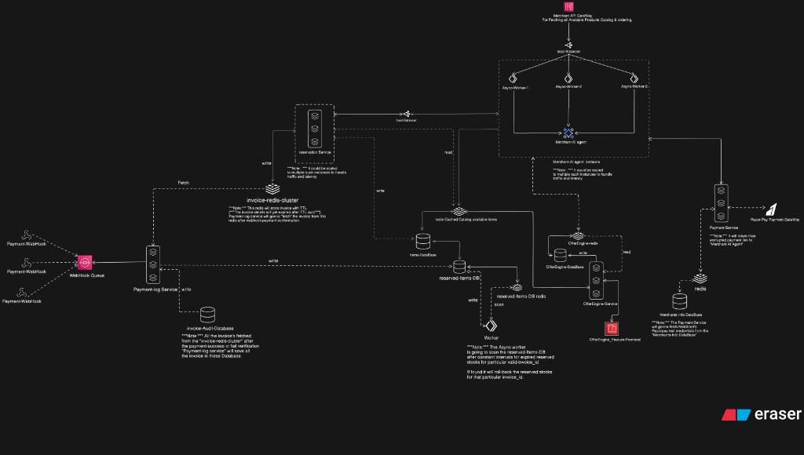

# Merchant AI Agent

> **Agent talks to agent. Stock reserved. Payment settled.**

A niche prototype for **agent-to-agent (A2A) grocery / retail ordering**: a Consumer AI Agent converses with a Merchant AI Agent to browse catalog, reserve inventory, apply offers, and complete payment—without a traditional human checkout UI. Built as **plugin-ready infra** that large e-commerce hubs, online stores, or offline retail backends could adopt.

**Project root:** `Merchant-AI-Agent/` (this folder). Deeper build notes: [`docs/HOW_THE_AGENT_BUILT_THIS.md`](docs/HOW_THE_AGENT_BUILT_THIS.md).

## System design



---

## 1. What Is Merchant AI Agent?

Merchant AI Agent is the **merchant-side brain** in an A2A commerce loop:

- A **consumer agent** (or our demo chat UI) discovers how to connect, then sends natural-language order turns.
- The **merchant agent** resolves products against a live catalog, collects delivery fields, handles stockouts/alternatives, surfaces offers, and—on confirmation—creates an invoice, **reserves stock**, and returns a **Razorpay payment link**.
- Payment confirmation arrives asynchronously via **webhooks → queue → payment-log**, with TTL-based cleanup for abandoned checkouts.

Merchants use a web dashboard to sign up, upload catalog, chat-test the agent, copy a **consumer connect link**, and review invoice audits.

---

## 2. Why We Built This (problem statement)

Checkout and payments were designed for **humans clicking buttons**, not for **agents negotiating and paying on a user’s behalf**.

We noticed the industry moving toward **agentic payments**—including public direction around **NPCI’s agentic payment ecosystem** in India—and decided to build a **focused prototype** of the missing merchant-side layer:

| Gap | What breaks today |
|-----|-------------------|
| **A2A commerce** | Agents can chat, but “order + authorize + pay + settle” between agents is immature |
| **Authority** | Without a **human mandate** bound into the machine conversation, agent spend is unsafe |
| **Concurrency** | Hot SKUs get **oversold** if inventory is locked poorly under burst traffic |
| **Abandoned carts** | Unpaid holds must **expire and roll back** without manual ops |
| **Sync payment pain** | Blocking the agent turn on the payment gateway kills latency and resilience |

**Inspiration / protocols we aligned with:** emerging **APA** (agent payment authorization) and **AP2**-style patterns for mandates and agent turns. We implemented a **working end-to-end path** (discovery → converse → mandate gate → reserve → pay link → webhook audit) as **niche reference infra**—not a certified national rail. Mandate cryptographic verification is still **demo-mocked** in Phase 1 and marked for real AP2/ACP verification before production.

**Who it’s for:** teams building plugins for big commerce platforms, online stores, or offline/retail backends that want an A2A ordering + payment spine they can extend.

---

## 3. Solution (how we address it)

We separate **browse → reserve → pay → confirm** into services with clear ownership (see the system design diagram above):

1. **Discover & connect** — Public `/agent.json` (+ `/.well-known/agent.json`); per-merchant `/connect/{merchant_id}`; `POST /v1/converse`.
2. **Authorize the agent turn** — Worker verifies a **human-sign mandate** before the merchant graph runs.
3. **Merchant AI Agent (LangGraph)** — Intent parse, catalog resolve, offers/ReAct tools, availability, field collection, invoice confirmation, finalize.
4. **Catalog speed** — Redis-cached items in front of Postgres (**~O(1)** on cache hit).
5. **Stock safety** — Reservation service + reserved-items DB + **TTL**; unpaid holds expire.
6. **Offers** — Isolated offer engine (own Redis/DB) so promos don’t block the order path.
7. **Payments** — Payment service builds Razorpay links (credentials from merchant store); **payment-log** consumes webhook queue, loads invoice from Redis TTL cluster, writes **invoice audit**.
8. **Cleanup** — Async worker scans expired reservations and rolls stock back.

Horizontal scaling targets: gateway → async workers → merchant agent instances.

---

## 4. Human Sign Mandate (what it is, what it grants, how we verify)

### What exactly is a Human Sign Mandate?

A **Human Sign Mandate** is a compact authorization the **human user** gives their **Consumer AI Agent**. The consumer agent must present it on every order turn (`human_sign_mandate` on `POST /v1/converse`).

Think of it as a short digital **power of attorney** for that agent session: it proves a human allowed *this* agent to open contact with a merchant agent and start an A2A commerce conversation. Without it, the merchant side refuses the turn (`MANDATE_INVALID`).

In our wire format the token is **base64-encoded JSON** with these claims (`MandateClaims`):

| Claim | Meaning |
|-------|---------|
| `issuer` | Who authorized the consumer agent (must appear on the merchant’s **trusted mandate issuers** list) |
| `subject` | Who the mandate is about—typically the consumer agent identity |
| `issued_at` | Unix timestamp when the mandate was issued (used for freshness / max age) |
| `signature` | Cryptographic proof that the issuer really signed these claims |

Demo clients (chat UI / scripts) build a Phase-1 placeholder mandate; production should replace this with real APA/AP2-style signed mandates.

### What it tells the Merchant AI Agent about permissions

When verification succeeds, the merchant system treats the consumer agent as **human-authorized to contact this merchant**, under the issuer whitelist the merchant configured. Concretely it signals:

1. **Trusted contact** — The agent is not anonymous noise; a known `issuer` backed the session.
2. **Merchant-controlled allowlist** — Only issuers in that merchant’s `trusted_issuers` (or a carefully enabled global fallback) may talk to this shop.
3. **Fresh authority** — The mandate is recent enough (`issued_at` within `MANDATE_MAX_AGE_SECONDS`), so old stolen tokens age out.
4. **Non-replayable proof** — A used signature hash is remembered in Redis so the same mandate cannot be replayed indefinitely.
5. **Gate before money/stock** — Reservation and payment-link steps only run inside the agent graph after the worker has set `mandate_verified: true`.

**Protocol ambition vs Phase 1:** richer APA/AP2 scopes (max spend, category limits, absolute expiry, real public-key crypto) are the target shape. Today we enforce the **contact gate** fields above; full cryptographic signature verification against an issuer public key is still **mocked** and marked for real AP2/ACP verification before production.

### Verification workflow inside this solution

Implemented in the async worker (`verify_mandate`), before any Merchant AI Agent graph turn:

1. Consumer agent includes `human_sign_mandate` on `POST /v1/converse`.
2. **Gateway** assigns/keeps `session_id` and forwards to the **async worker**.
3. Worker **decodes** base64 → JSON and validates `MandateClaims`.
4. Loads **trusted issuers** for the target `merchant_id` (Redis cache, then Postgres merchant row). If the merchant has no list and global fallback is disabled, verification fails.
5. Checks `issuer` is in that trusted list.
6. Checks `issued_at` is not in the future and not older than `MANDATE_MAX_AGE_SECONDS`.
7. Requires a **non-empty** `signature` (Phase 1 does **not** yet verify a real asymmetric signature—demo accepts any non-empty string after the other checks).
8. **Replay protection:** computes `sha256(signature)`, looks up Redis key `mandate:seen:{hash}`; if already seen → fail; else set with a short TTL (e.g. 300s).
9. On **failure** → respond with `MANDATE_INVALID`, write `MANDATE_VERIFY_FAILED` audit; agent graph never runs.
10. On **success** → forward to the merchant agent with `mandate_verified: true`. The LangGraph pipeline also treats an unverified mandate as a missing required field (“Verified Human Sign Mandate”), so stock reserve / invoice / payment link cannot proceed without the gate.

```text
Consumer Agent
  |  human_sign_mandate
  v
Gateway  -->  Async Worker (verify_mandate)
                 |-- fail --> MANDATE_INVALID + audit
                 |-- ok   --> mandate_verified=true
                                   v
                            Merchant AI Agent (LangGraph)
                                   v
                         reserve / invoice / payment link
```

---

## 5. How a request flows

| Step | What happens |
|------|----------------|
| 1. Discover | Consumer agent fetches `/agent.json` or opens merchant connect link |
| 2. Converse | `POST /v1/converse` with `consumer_agent_id`, `message`, `human_sign_mandate`, optional `merchant_id` / `session_id` |
| 3. Mandate | Async worker verifies mandate → forwards to merchant agent |
| 4. Order dialogue | Agent resolves SKUs, asks for brand/qty/address/phone/name as needed |
| 5. Confirm | User/agent says Proceed → invoice generated |
| 6. Reserve + pay | Stock reserved; Razorpay payment link returned in reply |
| 7. Settle | Razorpay webhook → queue → payment-log → invoice audit |
| 8. Expire | If no pay before TTL → reservation released, stock restored |

Typical multi-turn statuses: `AWAITING_FIELDS` → `AWAITING_CONFIRMATION` → `INVOICED` (or `FAILED`).

---

## 6. Technologies used

### Backend

- **Python 3.11+**, **FastAPI**, **Uvicorn**
- **LangGraph** + **LangChain** + **Gemini** (`langchain-google-genai`) — merchant agent graph
- **SQLAlchemy async** + **Postgres** — catalog, orders, audits, merchants
- **Redis** — session/cart state, catalog cache, invoice TTL, mandate replay keys
- **Kafka** + **aiokafka** — Razorpay webhook pipeline
- **httpx** — service-to-service calls
- **PyJWT** / **passlib** — merchant auth
- **Docker Compose** — full local/prod-shaped stack

### Frontend

- **React** + **TypeScript** + **Vite** + **Tailwind** — landing, auth, catalog upload, chat, invoices, agent discovery

### External

- **Razorpay** — payment links + webhooks
- **Google Generative AI** — intent / light generation inside the agent

---

## 7. System components

| Component | Responsibility |
|-----------|----------------|
| **Gateway** | Public converse API, rate limits, session id assignment |
| **Async worker** | Mandate gate; forwards verified turns to the agent |
| **Merchant AI Agent** | LangGraph order pipeline (catalog, offers, reserve, invoice) |
| **Merchant admin** | Catalog CSV/XLSX upload → items DB (+ cache warm) |
| **Auth service** | Merchant signup/login/profile JWT |
| **Reservation service** | Submit invoice / hold stock; TTL-oriented holds |
| **Payment service** | Create/cancel Razorpay payment links |
| **Payment-log service** | Webhook ingress, queue consumer, invoice audit APIs |
| **Offer engine** | Discounts, campaigns, cross-sell style lookups |
| **Frontend** | Merchant dashboard + public `/agent.json` for consumer agents |
| **Postgres / Redis / Kafka** | Durable data, hot cache/TTL, async payment events |

---

## 8. How data is stored (short)

| Store | Used for |
|-------|----------|
| **Postgres** | Items, merchants, orders, personal memory, invoice audits, offers |
| **Redis** | Session/order draft, catalog cache, invoice payloads with TTL, mandate replay |
| **Kafka** | Durable handoff of payment webhooks to payment-log workers |

---

## 9. Technical efficiency (short)

| Area | Technique | Note |
|------|-----------|------|
| Catalog reads | Redis over Postgres | ~**O(1)** cache hit |
| Stock | Reserve-then-pay + TTL | Reduces oversell under concurrency |
| A2A authority | Mandate on converse | Human authority bound to agent turns |
| Payments | Webhook + queue | Agent hot path not blocked on gateway RTT |
| Abandoned carts | TTL + async scanner | Cleanup off the conversational path |
| Agent | Procedural LangGraph; LLM for parse/intent | Predictable pipeline |

---

## 10. Security notes

- Merchant JWTs for dashboard/invoice-audit APIs
- Mandate required on converse (demo verification in Phase 1)
- Secrets only in server `.env` / deploy secrets—never commit `.env`
- Webhook path designed for async, idempotent-style processing (see payment-log)

---

## 11. Repo layout

- `services/` — gateway, async_worker, merchant_agent, auth, admin, reservation, payment, payment_log, offer_engine
- `frontend/` — Vite app (`/agent.json`, connect, chat, invoices)
- `docs/DEPLOY.md` — VPS + GitHub Actions
- `docs/GITHUB_SECRETS.md` — secret checklist
- `docs/images/system-design.jpg` — architecture diagram used in this README

---

## Prerequisites

Install these first:

- Python `3.11+`
- [`uv`](https://docs.astral.sh/uv/)
- Docker Desktop (daemon running)
- Node.js `18+`

## 10-Minute Quick Start (Docker Compose)

From repo root:

1. Copy environment template and configure key:
   - Copy `.env.example` to `.env`
   - Set `GOOGLE_API_KEY` in `.env` manually (do **not** commit real keys)
   - Host Postgres is mapped to **port 5433** and Redis to **port 16379** (`DATABASE_URL=...@localhost:5433/...`, `REDIS_URL=redis://localhost:16379/0`) so they do not clash with local services. Inside Docker Compose, services still use `postgres:5432` and `redis:6379`.

2. Install Python dependencies:
   - `uv sync`

3. Start infra and services:
   - `docker compose up --build -d`

4. Apply DB migrations:
   - `alembic upgrade head`

5. Seed catalog data:
   - `python -m scripts.seed_catalog`

6. Optional scaling demo:
   - `docker compose up --scale async_worker=2 --scale merchant_agent=2 -d`

## Run Without Full Compose (Local Service Processes)

If you do not want to run the full compose stack, run services manually in separate terminals:

- `uvicorn services.gateway.main:app --host 0.0.0.0 --port 8000 --reload`
- `uvicorn services.async_worker.main:app --host 0.0.0.0 --port 8001 --reload`
- `uvicorn services.merchant_agent.main:app --host 0.0.0.0 --port 8002 --reload`
- `uvicorn services.merchant_admin.main:app --host 0.0.0.0 --port 8003 --reload`

You still need:

- `uv sync`
- `alembic upgrade head`
- `python -m scripts.seed_catalog`

## Demo Flows

From repo root:

- Happy path conversation:
  - `python scripts/demo_converse.py`

- Mandate-failure conversation:
  - `python scripts/demo_converse.py --invalid-mandate`

## Frontend

Start the frontend Vite app:

- `cd frontend`
- `npm install`
- `npm run dev`

Consumer agents can also fetch discovery JSON at `/agent.json` and `/.well-known/agent.json` once the frontend is serving.

## Secrets and environment

- Copy `.env.example` → `.env` for local development. **Never commit `.env`.**
- For production on a VPS, use `.env.production.example` as a template → server `.env` (`chmod 600`).
- Frontend: copy `frontend/.env.example` → `frontend/.env` locally. Vite `VITE_*` values are public URLs only — do not put API keys there.
- Production deploy secrets (SSH) and app secrets stay in **GitHub Environments / server `.env`**, not in the repository. See [`docs/DEPLOY.md`](docs/DEPLOY.md).

## Production deploy from GitHub

This stack deploys to a Linux VPS with Docker Compose via GitHub Actions. Full steps: [`docs/DEPLOY.md`](docs/DEPLOY.md). Secrets checklist: [`docs/GITHUB_SECRETS.md`](docs/GITHUB_SECRETS.md).

## Test Suite

Run tests from repo root:

- `.\.venv\Scripts\python -m pytest -q`

## Phase notes

See [`docs/PHASE2_BUILD_NOTES.md`](docs/PHASE2_BUILD_NOTES.md) and related docs under `docs/`.

Current intentional constraints:

- Mandate cryptographic verification is mocked for demo behavior (replace with real AP2/ACP verification before production).
- Offer engine and Razorpay paths are wired for the A2A reserve-and-pay flow; configure live credentials only in server `.env`.
